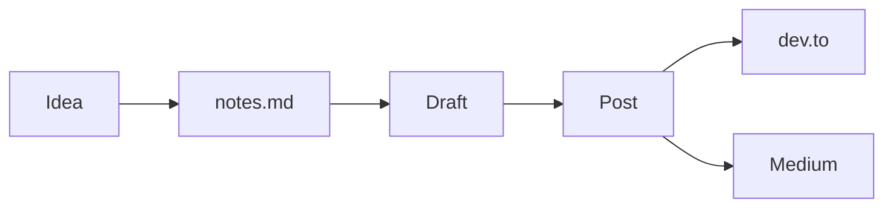

A short note on what this is.

I keep ending up writing the same paragraph in Slack DMs and pull-request descriptions — _"the reason we picked X over Y was…"_ or _"the bug ended up being a Postgres connection-pool thing."_ Those notes are useful and they keep dying in scrollback. So this is where they live now.

## What to expect

- short posts on what I'm shipping at work and on side projects
- the bug that took two days, written down in case it saves the next person two days
- occasional _"I tried X, here's whether it was worth it"_

Most posts here will originate as commit messages or PR comments and get expanded out. Cross-posted to [dev.to](https://dev.to) and sometimes [Medium](https://medium.com) with the canonical URL pointing back here.

## On the format

Posts are MDX, which means I can drop in real diagrams when prose isn't enough:



…and code, with proper monospace and syntax tokens:

```ts
// the simplest reading-time function that actually ships
const minutes = Math.max(1, Math.ceil(wordCount / 200));
```

If you came in from a search engine looking for the answer to a specific bug, I hope it helped. If you came in from somewhere I shared this — thanks for clicking.
