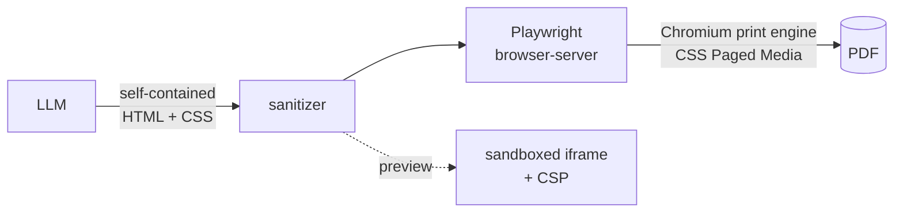

## The problem

DigiQuick generates digital products people actually sell — planners, invoices, journals, workbooks. A guided wizard turns a prompt into an artifact you can download as a PDF, an Excel workbook, a Notion page, or a deployable React app.

The PDF path is the demanding one. A planner has facing pages, repeating headers, page counters, controlled break points, and typography that has to survive at print resolution. If it looks like a web page someone screenshotted, nobody pays for it.

## The first pipeline, and its ceiling

The original build used `@react-pdf/renderer`: the model emits a React tree of PDF primitives, a worker pool renders it. It worked, and it had a hard ceiling.

React-PDF implements its own layout engine over a subset of flexbox. That's a reasonable trade for invoices and receipts, but it isn't CSS. There are no named pages, no page counters, no `break-inside`, no real control over widows and orphans — and the typography is whatever the library's text shaping gives you. For the documents this product ships, the fidelity gap kept showing up as "close, but obviously generated."

The other cost was structural. The pipeline carried a Babel transpile step so the model's JSX could be evaluated, plus a worker pool to keep that rendering off the request thread, plus the dependency surface underneath both.

## Handing it to Chromium

The replacement inverts the whole thing: **the model emits self-contained HTML and CSS, and Chromium prints it.**

That single change unlocks CSS Paged Media — `@page` rules, named pages, page counters, break control, and real font rendering. Everything the format needed already exists in a browser's print engine; the previous design had been reimplementing a worse version of it.

It also removed more than it added. Three dependencies gone, the Babel transpile step gone, the worker-pool scaffolding gone — replaced by a Playwright browser-server running as its own container that the API connects to. Rendering still happens off the request thread, but the isolation boundary is now a process the platform already knows how to health-check and restart, rather than scaffolding I maintain.

The bulk of the work wasn't the renderer swap. It was the prompt. Chromium's print engine has opinions that don't match screen rendering, and the model has to know them up front: viewport units are meaningless in print, flex and grid containers swallow page-break properties, and `position: fixed` prints once rather than on every page. Those quirks are now stated explicitly in the generation prompt, because a model that doesn't know them produces HTML that looks right in a preview and breaks across page boundaries.

## The model is an untrusted input

The uncomfortable part of this design: I'm taking text a language model produced and rendering it as markup, in a browser, on my infrastructure.

Prompt injection makes that a real threat model rather than a theoretical one. If a user can steer generation, they can attempt to steer what gets rendered — and the rendering context is one I control and they don't.

So model output is treated the way you'd treat a file upload, at three layers:

1. **Sanitize** the HTML before it goes anywhere, stripping script vectors and dangerous attributes.
2. **Sandbox** the preview in an iframe with an empty `sandbox` attribute — no scripts, no same-origin, no forms.
3. **Constrain** it with a CSP meta tag inside the rendered document.

The sanitizer has the most tests of anything in the pipeline, and the interesting one isn't a threat case — it's a preservation case. Sanitizers reflexively strip `<style>` blocks, and here the `<style>` block _is_ the document: strip it and every artifact renders as unstyled text. So there's a test pinning that `<style>` survives, precisely because the safe-looking default would silently destroy the product.

That tension is the whole design. The sanitizer has to be aggressive about scripts and permissive about presentation, and those two requirements pull against each other in exactly the place where a careless change breaks either security or output.

## What broke

**The editor lied about what the user typed.** Artifacts are editable in a Monaco editor, and Monaco's `onChange` fires for programmatic `setValue` calls, not just human keystrokes. Loading a new version into the editor therefore looked identical to the user typing it — which silently seeded stale code as the live document. Version scrubbing wrote whatever you scrubbed past back into the artifact. Four tests pin that behaviour now, because the bug is invisible in every manual test where you only ever type.

**The preview flashed.** Swapping the preview between artifact versions rendered blank for a beat before the new document painted, so scrubbing the version slider strobed. The fix was a blank-render guard plus double-buffering the fade — hold the previous frame until the next one is genuinely ready. Not deep, but it's the difference between a tool that feels solid and one that feels held together.

**The browser needed supervision.** Running Chromium as a long-lived service means it can disconnect, wedge, or die while the API keeps assuming it's there. The service reconnects on disconnect, serializes access with a mutex so concurrent renders can't collide in one browser, shuts down cleanly, and the container carries a health check. All of that is unglamorous and none of it was in the first version.

## What I'd do differently

**Reach for the platform sooner.** The first pipeline lost to a browser's print engine — a piece of software with two decades of work behind it that was available from the start. I spent effort improving a custom layout path when the real question was whether it should exist. "Is there a mature engine that already does this?" is a cheaper question than any optimization I ran.

**Threat-model the model earlier.** Sanitization arrived with the HTML pipeline because HTML made the risk obvious. But the earlier design was also executing model-authored code — JSX through a transpiler — and I hadn't thought about it in those terms. The risk didn't appear when I switched renderers; it became visible.

**Test the seams, not the units.** Every bug worth writing about here lived between two components that were individually fine: the editor and the document state, the preview and the version list, the API and the browser process. Unit tests were never going to find them.

## Stack

`NestJS 11 · Playwright + headless Chromium · TypeORM · PostgreSQL · Redis · BullMQ · Next.js 16 · React 19 · Monaco · pnpm/Turborepo`

[Live](https://digiquickai.com)
