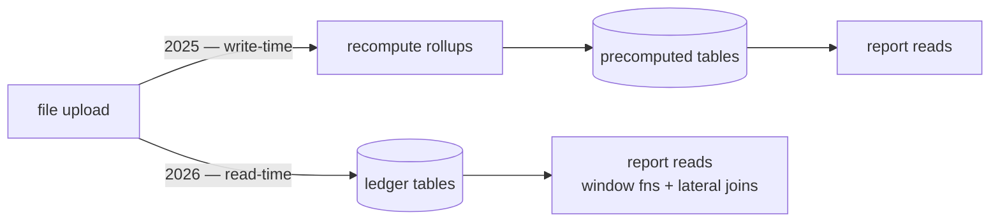

## The problem

iDelta's accounting side answers questions brokers ask constantly: what was my P&L yesterday, what margin am I carrying, what interest is due. Each of those reads across trading ledgers that grow by roughly a million rows a day, and each one has to survive files arriving late and out of order.

The reports were slow — comfortably over two seconds. This is the story of fixing that twice, because the first fix was the wrong shape.

## Attempt one: materialize it

In July 2025 I added two rollup tables — `interest_report_precomputed` and `pnl_summary_precomputed` — keyed per account and date, holding the aggregates the reports needed. Reads got fast, which felt like the end of the story.

It wasn't, because of the write path. A row's correctness depended on four different file types: margin, interest, journal vouchers, and receipt/payment. Any upload of any of them could invalidate rollups it never mentioned, so the recompute had to fan out on every ingestion. Both tables also carried `ON DELETE CASCADE` foreign keys to `file_status`, which meant deleting one uploaded file dragged a cascade through multi-million-row tables.

So the cost never really went away. It moved from the read path, where it was visible and measurable, to the write path, where it was diffuse and only showed up when someone deleted a file and wondered why the request hung.

## Attempt two: delete it

I unwired the precompute reads in December 2025 and the reports went back to querying ledgers directly. The entities were deleted a couple of months later in a dead-code sweep.

The actual rewrite landed in March 2026 across the report services, the P&L summary, and the bank ledger. The techniques were unglamorous: `ROW_NUMBER()` partitioned by account and date to pick a winning row per day, CTEs where a correlated subquery had been, and `unnest`-driven lateral joins so a batch of accounts and target dates could be answered in one pass instead of one round-trip per entity.

The number I care about from that change is the diff. Across the three commits it removed about 4,500 lines and added about 3,800 — a net deletion. Correlated subqueries and per-entity loops are verbose; the set-based versions that replace them are usually shorter as well as faster. Measured in production, report queries went from over two seconds to under 300ms.

One habit I'd keep: the rewrite left `Recommended Indexes:` comment blocks naming the exact composite and partial indexes the new query shapes wanted. Two days later I shipped a migration creating precisely those — sixteen indexes, four of them partial on `deletedAt IS NULL`. Writing down what the query needs, at the moment you understand it, means the migration is a transcription rather than an archaeology exercise.

## The bug I introduced doing it

The rewrite broke correctness, and it took me two weeks to notice.

Turnover rows are per account, per date, per scrip. Interest and peak interest are per account, per date. Summing a column across a join of the two inflates the per-day values by however many scrips that account traded — a trader with twelve positions got twelve times their actual interest. The old code had avoided this by accident of its structure; the new set-based version summed everything uniformly and walked straight into it.

The fix was to take the latest entry per account per day for the genuinely per-day quantities, and keep summing only the additive ones. That distinction — which columns fan out and which don't — is now the thing I check first when a report aggregate looks wrong.

The same pass turned an inner join on family into a `LEFT JOIN`, because traders with no family assigned had been silently dropping out of the family view. Nobody had reported it. They just weren't there.

## What I'd do differently

**Measure before materializing.** I reached for precompute because reports were slow, without first establishing _why_ they were slow. They were slow because of correlated subqueries and N+1 access patterns, and those were fixable in place. Materialization is a reasonable answer to "the computation is genuinely expensive" and a poor one to "the query is badly shaped" — and I didn't distinguish before writing the tables.

**Finish the deletion.** The migrations that were supposed to drop those two tables are auto-generated no-ops — they contain no `DROP TABLE`. I removed the entities and the code, and the tables are, as far as I know, still sitting in production holding stale rows nothing reads. Removing code is not the same as removing storage, and I only half did the job.

**Regression-test the aggregates.** The fan-out bug would have been caught immediately by a fixture with one account, one day, and two scrips. There wasn't one.

## Stack

`NestJS 11 · TypeORM · PostgreSQL 17 · Redis · BullMQ · React 19 + Vite · pnpm/Turborepo`
